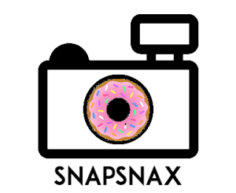

# SnapSnax

A android app that allows you to keep track of your calories for the day 
Creators: Tanvi Wagle, Neha Nishikant, Ashna Mediratta, Sammy, Riya Patel 

## Inspiration:
A lot of the times, we tend to just grab the food that's in front of us and we don't really know what it is that we are putting into our bodies. Our goal is to make it easier to become aware of our food intake, and to adjust for a healthier diet. 

## How it works:
In our app, users can snap a photo of the nutrition label on an item of food they eat, and the calorie count on this item is added to the user's calorie count for the day. Based on the sex, height, weight, and age, of the user we calculate a recommended calorie intake.

## Layout 
- Page 1: Menu
- Page 2: Live Camera View to add a new nutrition label
- Page 3: Input personal information

## How we built it: 
We based our app around Google's Cloud Vision API. First, we used the API in it's simplest implementation by allowing users to upload any picture and then displaying what the API thinks the picture is of.
Then, we delved further into the Vision API and used its Optical Character Recognition to detect and extract text from the view of a live camera view.
When we pointed the camera at a nutrition label, we received a lot of text. Thus, we parsed through this mass of data and extracted only the calorie count of the nutrition label.
We then incorporated this use of API into an app with multiple different pages to create the android app
Finally, after some logo design and layout, we gave a name to our fully fledged SnapSnax!

## Accomplishments we are proud of:
We are proud of our integration of the Optical Character Recognition Cloud Vision Google API into our app
As this is only our second hackthon, we are proud of our delegation, efficiency, and work ethic.

## What's Next
Firstly, we would like to be able to use persisting data. The most important thing that we did not have the opportunity to complete was the ability to save your data for long periods of time.
Counting calories is not the only way to keep track of your health. It's also important to regulate your intake of other nutritional factors like sugar, sodium, vitamins, etc. Thus, next, the best step would be to incorporate these other elements into our app to allow for a more comprehensive indicator of health.
We would also like to extend this app to other platforms such as iOS.
